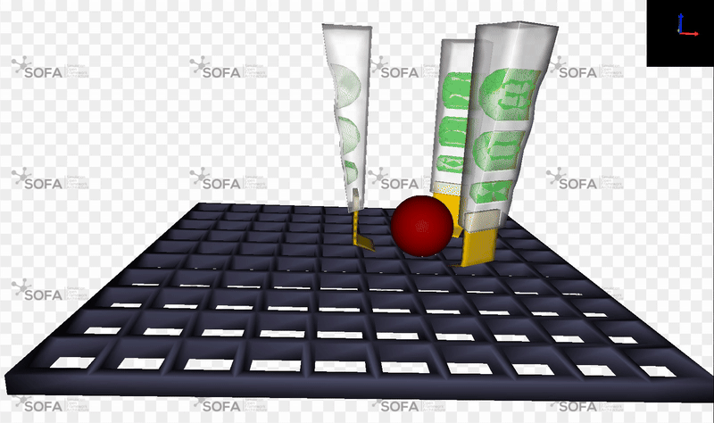

# ME5415_Food_Gripper
Soft robot gripper for food preparation. Simulation of gripper and food items using SOFA framework, built based on the tutorial Pneunet gripper given in https://github.com/SofaDefrost/SoftRobots/tree/master/examples/tutorials/PneunetGripper.

For NUS ME5415 Advanced Soft Robot course.

## Scripts
``Main.py`` Generates the simulation in a popup GUI. Tweak the food item added by commenting/uncommenting the corresponding function in createScene()\
``PickObjects.py`` Contains functions to generate various items such as deformable food and immovable cubes. Tune the properties of the food objects (e.g. elastic modulus) here\
``Gripper.py`` Contains code to generate the gripper object\
``GripperController.py`` Contains code to control the gripper movement and behaviour. Also contains commented out code to measure force output and displacements of gripper\

## Folders
``CAD\`` Contains 3D models of the gripper and scene floor. Files include .step, .stl and .vtk, with .vtk files generated by the gmsh standalone executable (using .step files)\
``Objects\`` Contains 3D models of the food objects. Files include Solidwork food models, Fusion360 gripper model, .step, .stl and .vtk

## Running the simulation
1. Install the requirements below in a conda environment
2. Uncomment the desired food item and tweak properties as needed
3. Run ``Main.py``, then click ``Animate`` in the top left of the simulation GUI to start 
4. Control the gripper using the following controls:
- CTRL + Left/Right arrow keys : Move gripper left/right along x-axis
- CTRL + Up/Down arrow keys : Move gripper up/down along z-axis
- CTRL + Space bar : Inflate gripper to close it
- CTRL + Minus (-) key : Deflat gripper to open it 
- V key : Start/stop video taking
- S key : Screenshot

# Requirements:
sofa-app sofa-python3 sofa-stlib sofa-softrobots sofa-modelorderreduction : v24.12.0\
``$ conda install sofa-app sofa-python3 sofa-stlib sofa-modelorderreduction sofa-softrobots --channel sofa-framework --channel conda-forge``

scipy : 1.15.2\
numpy : 2.2.5\
``$ conda install scipy numpy ``

gmsh : 4.13.1\
``$ pip install gmsh``

Tested on Windows 10, Python 3.12.10